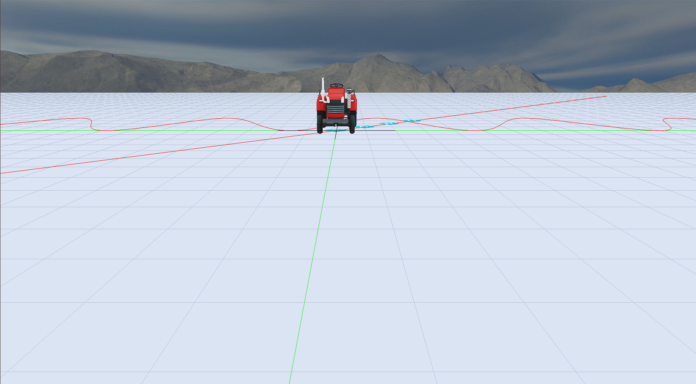

# opengles-cpp

## Introduce

C++ wrapper of opengles, there is a car driving scene in the project demo. It can be easily ported to Android using the native window instead of glfw3.

## Required

Necessarities in os `Ubuntu 18.04.6 LTS` are listed below

- libassimp-dev
- libglfw3-dev
- libfreetype6-dev
- libgles2

## Build

Use cmake to build your project

```cmake
mkdir build
cd build
cmake . ../
make -j8
```

## Run

The running effect is as shown in the figure below
